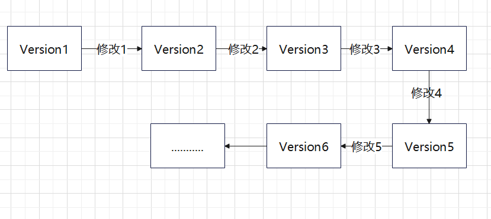
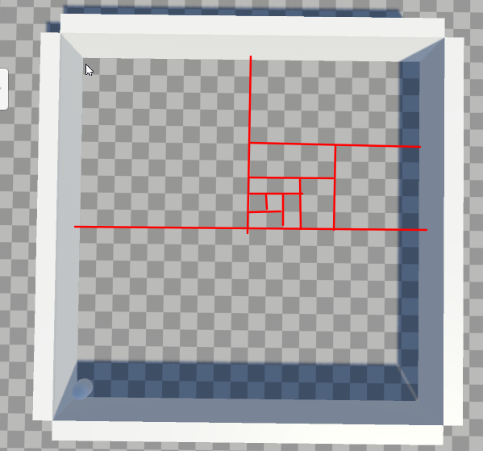
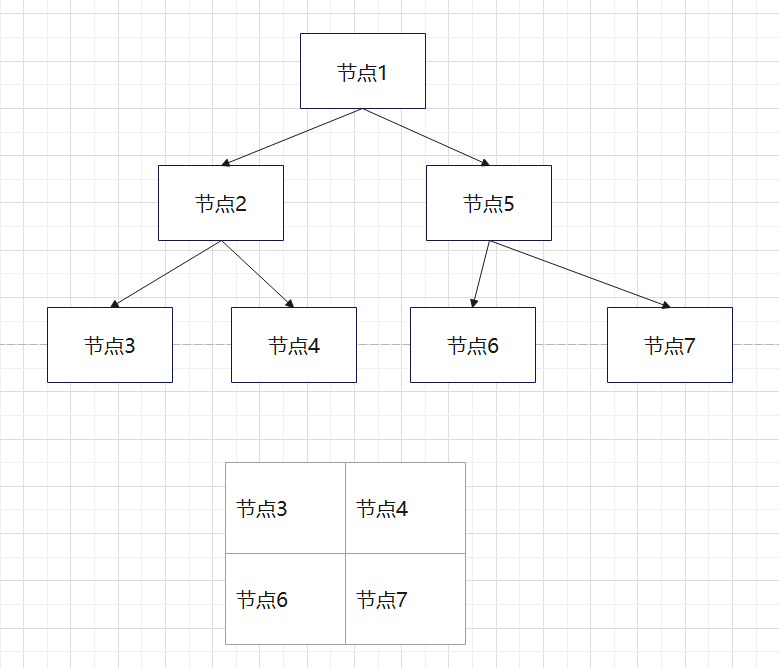
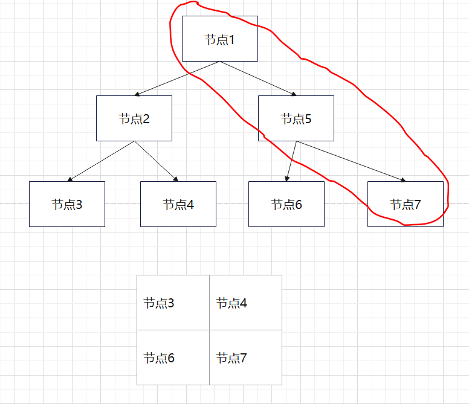
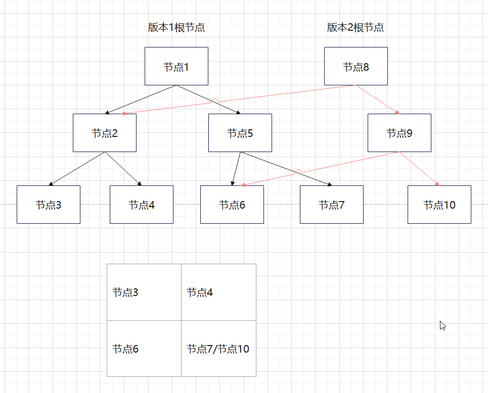

# VersionManageModule

author：张晓鹏

## 1. 概况

适用空间划分 + 可持久化线段树管理地图的方块放置，实现版本管理，类似于git的版本回退、版本转跳。


## 2. 使用情景

对于版本管理可以记录每次版本的修改，然后回退时依次执行版本的修改的逆即可复原，如下图：



假设当前是版本6，我们要回退到版本2，那么就要依次执行修改5、修改4、修改3、修改2的逆，复杂度为O(n*m)，其中n是版本数量，m是每次执行修改的复杂度数量级；对此如果版本数量非常多，即n非常大时，回退一次版本的时间复杂度时非常高的。

对此，可持久化线段树就派上用场了，我们可以用空间划分 + 可持久化线段树 来实现O(logn * m)的复杂度，具体实现见下面。


## 3. 具体实现

这里以寻路模块的地图的方块的版本管理为例来实现。

总体思路：

1. kd树划分思路对地图进行划分：将地图进行划分，适用kd树的划分思路对该二维地图轮流对x轴和z轴进行划分，从而构建一颗二叉树来管理该二维地图的方块。
2. 可持久化线段树思路进行版本管理：每次放置方块时新建一个根节点来复制前一个版本的kd树，当节点不是修改的方块时直接指向前一个版本的节点复制即可，当节点是修改的节点是新建一个节点来存储修改，这个修改被存储在当前版本的根节点下。
3. 版本转跳时直接找到对应的根节点，然后遍历其kd树即可还原二维地图，遍历复杂度为logn，每个节点的还原复杂度为m，因此中复杂度优化为 O(logn * m)。

### 2.1 kd树划分思路对地图进行划分

对地图的x轴和z轴轮流进行划分，每个节点对应一定范围的矩形：



划分之后kd树的每个叶子节点对应一个格子，每个节点的区域为其子树的所有叶子节点构成的区域：



如上图，节点1管理整个地图，节点2管理节点3和节点4的区域....


核心代码：

```c#

    /// <summary>
    /// 建立线段树
    /// </summary>
    /// <param name="xLeft">当前节点对应的区间范围</param>
    /// <param name="xRight">当前节点对应的区间范围</param>
    /// <param name="zBottom">当前节点对应的区间范围</param>
    /// <param name="zTop">当前节点对应的区间范围</param>
    /// <param name="isXAxis">当前是否对x轴进行划分</param>
    /// <returns></returns>
    private int build(int xLeft, int xRight, int zBottom, int zTop, bool isXAxis)
    {
        //Debug.LogError(xLeft + "  " +  xRight + "  " + zBottom + "  " + zTop + "  " + isXAxis);
        //返回标志值
        int p = nodeIdx++;

        if (tree[p] == null)
        {
            tree[p] = new TreeNode();
        }

        tree[p].xLeft = xLeft;
        tree[p].xRight = xRight;
        tree[p].zBottom = zBottom;
        tree[p].zTop = zTop;
        if (xLeft == xRight && zBottom == zTop)
        {   //到叶子节点了
            tree[p].count = 0;
            tree[p].type = GraphObjType.None;
            tree[p].lTree = -1;
            tree[p].rTree = -1;
            return p;
        }

        if (isXAxis && xLeft != xRight)
        {
            //划分x轴
            int xMid = (xLeft + xRight) >> 1;
            tree[p].lTree = this.build(xLeft, xMid, zBottom, zTop, !isXAxis);
            tree[p].rTree = this.build(xMid+1, xRight, zBottom, zTop, !isXAxis);
        }
        else if(!isXAxis && zBottom != zTop)
        {
            //划分z轴
            int zMid = (zBottom + zTop) >> 1;
            tree[p].lTree = this.build(xLeft, xRight, zBottom, zMid, !isXAxis);
            tree[p].rTree = this.build(xLeft, xRight, zMid+1, zTop, !isXAxis);
        }
        else if(xLeft != xRight)
        {
            //划分x轴
            int xMid = (xLeft + xRight) >> 1;
            tree[p].lTree = this.build(xLeft, xMid, zBottom, zTop, !isXAxis);
            tree[p].rTree = this.build(xMid + 1, xRight, zBottom, zTop, !isXAxis);
        }
        else if(zBottom != zTop)
        {
            //划分z轴
            int zMid = (zBottom + zTop) >> 1;
            tree[p].lTree = this.build(xLeft, xRight, zBottom, zMid, !isXAxis);
            tree[p].rTree = this.build(xLeft, xRight, zMid + 1, zTop, !isXAxis);
        }
        //Debug.LogErrorFormat("ltree:{0}  rtree:{0}", tree[p].lTree, tree[p].rTree);
        tree[p].count = tree[tree[p].lTree].count + tree[tree[p].rTree].count;

        return p;
    }

```


### 2.2 可持久化线段树思路进行版本管理

以上面的简易版kd树为例切入讲解可持久化。

如下图，假设我们现在在节点7的格子放置一个方块，即修改了格子7，此时牵连到的节点为节点7、节点5、节点1，也就是kd树需要修改这几个节点的信息：



但我们不应该直接修改，因为我们要做的是版本管理，要实现版本回退，所以可以增加一个根节点来记录修改到的系列节点，而未被修改到的节点直接复制其指针即可；此时适用logn的空间来记录了一个版本的修改，本质就是用logn的空间换时间；演示图如下：



因此当我们要回退到版本1或版本2时直接找到版本1或版本2的根节点，从根节点遍历即可复原该版本的所有地图信息。


核心代码：

```c#

    /// <summary>
    /// 放置方块
    /// </summary>
    /// <param name="preNode">当前区间对应上一个版本的节点</param>
    /// <param name="xLeft">当前区间范围</param>
    /// <param name="xRight">当前区间范围</param>
    /// <param name="zBottom">当前区间范围</param>
    /// <param name="zTop">当前区间范围</param>
    /// <param name="x">放置方块的位置</param>
    /// <param name="z">放置方块的位置</param>
    /// <param name="type">放置的方块类型</param>
    /// <param name="isXAxis">当前是否划分x轴</param>
    /// <returns></returns>
    private int insert(int preNode, int xLeft, int xRight, int zBottom, int zTop, int x, int z, GraphObjType type, bool isXAxis)
    {
        //返回值是新版本树节点的标志值
        int curNode = nodeIdx++;
        
        tree[curNode] = new TreeNode(tree[preNode]);  //先将上一个版本信息复制过来
        if (xLeft == xRight && zBottom == zTop)
        {  
            //遍历到叶子节点，同时找到了要插入的位置，cnt++
            tree[curNode].count = 1;
            tree[curNode].type = type;
            return curNode;
        }

        //接着找要插入的位置
        if (isXAxis && xLeft != xRight)
        {
            int xMid = (xLeft + xRight) >> 1;
            if (x <= xMid)
            {
                tree[curNode].lTree = this.insert(tree[preNode].lTree, xLeft, xMid, zBottom, zTop, x, z, type, !isXAxis);
            }
            else
            {
                tree[curNode].rTree = this.insert(tree[preNode].rTree, xMid + 1, xRight, zBottom, zTop, x, z, type, !isXAxis);
            }
        }
        else if(!isXAxis && zBottom != zTop)
        {
            int zMid = (zBottom + zTop) >> 1;
            if(z <= zMid)
            {
                tree[curNode].lTree = this.insert(tree[preNode].lTree, xLeft, xRight, zBottom, zMid, x, z, type, !isXAxis);
            }
            else
            {
                tree[curNode].rTree = this.insert(tree[preNode].rTree, xLeft, xRight, zMid+1, zTop, x, z, type, !isXAxis);
            }
        }
        else if(xLeft != xRight)
        {
            int xMid = (xLeft + xRight) >> 1;
            if (x <= xMid)
            {
                tree[curNode].lTree = this.insert(tree[preNode].lTree, xLeft, xMid, zBottom, zTop, x, z, type, !isXAxis);
            }
            else
            {
                tree[curNode].rTree = this.insert(tree[preNode].rTree, xMid + 1, xRight, zBottom, zTop, x, z, type, !isXAxis);
            }
        }
        else if(zBottom != zTop)
        {
            int zMid = (zBottom + zTop) >> 1;
            if (z <= zMid)
            {
                tree[curNode].lTree = this.insert(tree[preNode].lTree, xLeft, xRight, zBottom, zMid, x, z, type, !isXAxis);
            }
            else
            {
                tree[curNode].rTree = this.insert(tree[preNode].rTree, xLeft, xRight, zMid + 1, zTop, x, z, type, !isXAxis);
            }
        }
        
        tree[curNode].count = tree[tree[curNode].lTree].count + tree[tree[curNode].rTree].count;

        return curNode;
    }

```


## 4. 演示视频

<video src="README.assets/版本管理-kd树划分+可持久化线段树演示视频.mp4"></video>
